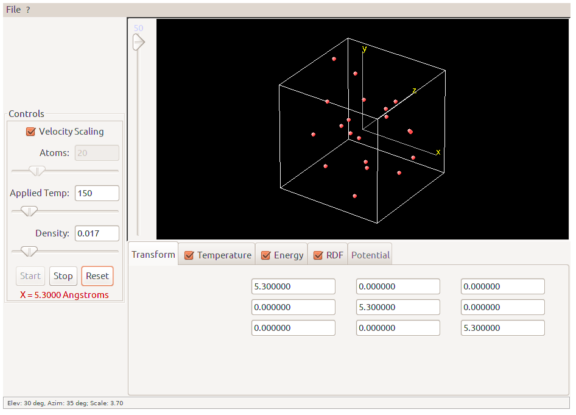

# 3DTorusApplet
This (standalone) applet is a simple three-dimensional simulation of a Lennard-Jones liquid. 

The atoms are initially set up on a square lattice, and given inital velocities to correspond to 150 degrees K. The timestep is 0.01 pico-seconds. To start the simulation, simply press the start button. The boundary conditions are periodic.

To the right of the atomic display are several settings that you can control. The top checkbox controls velocity scaling . When this is on, it basically forces the simulation to stay near a particular temperature, by rescaling the velocities every few timesteps.

Immediately below the velocity scaling checkbox is a slider which controls the temperature to which the velocites should be scaled. Note that this is only effective when velocity scaling is on!

Immediately below the applied temperature slider is a slider which controls the density. When this is adjusted the simulation is stopped, resized to correspond to the selected density, and started again. This has no visual effect on the atoms on the screen, but if you check the size indicator below, you will see that the size of the edge of the box has increased or decreased depending on your selection.

In the middle of the applet are three buttons, "start", "stop", and "reset." Clicking on the "start" button will begin the simulation. The simulation will run until you click either the stop, or reset button. The reset button re-initializes the atoms to the square lattice, and gives them new random initial velocities.

Below the start, stop and reset buttons are several checkboxes. Clicking on any one of them will bring up a corresponding display panel directly below them. When you first start the simulation you should see the energy panel. Each panel will allow you to visually monitor different aspects of the simulation. There are four different panels, the RDF panel, the energy panel, the temperature panel, and the potential panel. Click on any of these names for more information on how each panel works.

Clicking on the start button should start the simulation. You should be able to see the atoms moving around within the simulation box. Play around with the settings of applied temperature, and density and observe the changes in the various measurements shown in each panel. You also have the ability to change the potential in the potential panel.
